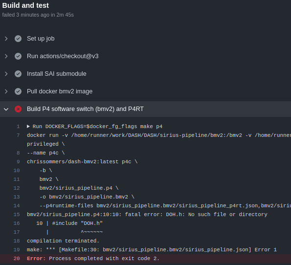

# DASH CI (Continuous Integration) Via Git Actions

- [DASH CI (Continuous Integration) Via Git Actions](#dash-ci-continuous-integration-via-git-actions)
    - [CI Build log - Passing example](#ci-build-log---passing-example)
    - [CI Build log - Fail example](#ci-build-log---fail-example)

This project contains [Git Actions](https://docs.github.com/en/actions) to perform continuous integration whenever certain actions are performed. These are specified in YAML files under [.github/workflows](../.github/workflows) directory.

* [dash-ci.yml](../.github/workflows/dash-ci.yml): A Commit or Pull Request of P4 code, Makefiles, scripts, etc.  will trigger a build of all artifacts and run tests, all in the Azure cloud. Status can be viewed on the Github repo using the "Actions" link in the top of the page. This will be true for forked repos as well as the main Azure/DASH repo.

  Two tests are currently executed in the CI pipeline. These will be increased extensively over time:
  * The `make run-test` target does a trivial SAI access using a c++ client program. This verifies the libsai-to-P4runtime adaptor over a socket. The test program acts as a P4Runtime client, and the bmv2 simple_switch process is the server.
  * The `make run-ixiac-test` target spins up a two-port software (DPDK) traffic-generator engine using the free version of [ixia-c](https://github.com/open-traffic-generator/ixia-c) controlled by a Python [snappi](https://github.com/open-traffic-generator/snappi) client. Using this approach allows the same scripts to eventually be scaled to line-rate using hardware-based traffic generators.
* [dash-dev-docker.yml](../.github/workflows/dash-dev-docker.yml): A commit of a Dockerfile under [dockerfiles](dockerfiles) will trigger the [make docker-XXX](#build-docker-dev-container) build target and rebuild the corresponding docker container. It will not publish it though, so it's ephemeral and disappears when the Git runner terminates. The main benefit of this is it may run much faster in the cloud than locally, allowing you to test for a successful build of changes more quickly.
* The CI badge will be updated according to the CI build status and appear on the front page of the repo (it's actually on the top-level README). You can click on this icon to drill down into the Git Actions history and view pass/fail details. Typical icons appear below:

      

Badges have flexibility, for example we could show the status of more than one branch at a time.

See:
* https://docs.github.com/en/actions/monitoring-and-troubleshooting-workflows
* https://docs.github.com/en/actions/monitoring-and-troubleshooting-workflows/adding-a-workflow-status-badge)
### CI Build log - Passing example

A typical "Good" CI log appears below, this can be watched in real-time:

  

### CI Build log - Fail example
A typical "Failed" CI log appears below. You can click on the arrow next to the red circled "X" and see details. In this example there is a (deliberate) P4 coding error.


Let's drill down into the Build P4 step which failed. We see a a bad statement. (There is no `#import` keyword for P4 or the C preprocessor).
```
#import DOH.h
```

  

The main README for this repo shows the CI failing badge:

