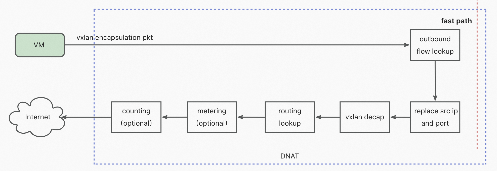
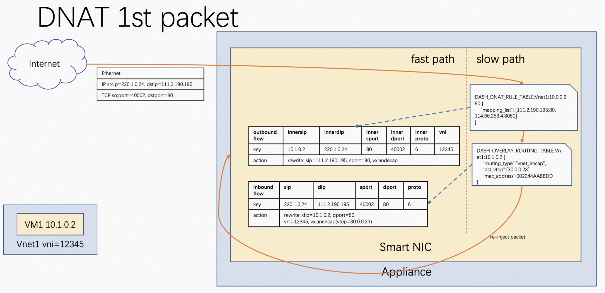
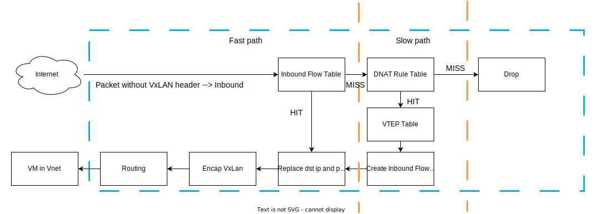

# NAT service

## Overview

NAT scenario describes NAT use case in 2 ways:

* VMs in VNET access Internet, aka SNAT, sessions initiated from VMs.
* Users from Internet access services hosted in the cloud VMs inside VNET, aka DNAT, i.e session initialted from Internet.

We use smart-switch in this HLD, acting the role of NAT gateway as well as underlay router.
This scenario provides the following capabilities:

* NAT service for TCP, UDP and ICMP packets.
* Routing service for underlay forwarding.
* VxLAN VTEP for traffic isolation.
* Billing service(by traffic volume and by committed traffic rate, i.e metering and counting).


## NAT service architecture


*Figure 1 - NAT scenario architecture*

Tenant1 access Internet service from VM1 and VM2 in VNET1 through NAT gateway running on a smart switch. Tenant2 provide service to the public, hosted on VM3 and VM4 in VNET2, Internet user access this service through NAT gateway running on a smart switch.

For both case, VMs in different VNET connects to Internet through a NAT gateway.

## Packet processing pipeline in NAT scenario

### Pre-service processing


* The pipeline parse the packet and extract VxLAN header fields: 'SIP', 'DIP', 'VNI'. If VxLAN header is absent, direction is 'inbound'. Otherwise launch a lookup into table 'DASH_SAI_VNET_TABLE' using key VNI. If hit, get direction from 'DASH_SAI_VNET_TABLE', if missed, direction is 'inbound'.
* Pipeline lookup: for NAT service, this can be skipped and directly go to next stage. Optionally, 'DIP' + 'DPORT' + 'VNI' can be used to launch a lookup into a 'DASH_SAI_SERVICE_PIPELINE_TABLE', if hit, get the processing pipe from table entry, if missed, drop the packet. 'VNI' used as part of the key if it's present.

### Generic NAT inbound processing pipeline

* For 'inbound' traffic, a lookup with key ['SIP', 'DIP', 'PROTO', 'SPORT', 'DPORT'] is launched into 'DASH_SAI_FLOW_TABLE'. The keys for 'inbound' are always extracted from overlay contents.
* If hit, apply fast path packet tranformation: replace DIP and DPORT, encap VxLAN header, launch LPM lookup with encapsualted DIP and send the packet out.
* If missed, push to slow path processing. Launch a lookup into 'DASH_SAI_NAT_TABLE' with keys ['DIP', 'DPORT'], if hit, obtain 'VNI', 'OUTER_DIP', 'OUTER_SIP', then ADD an entry into 'DASH_SAI_FLOW_TABLE" for inbound fast path and reverse path(outbound). If missed, drop the packet.

### Generic NAT outbound processing pipeline

* For 'outbound' traffic, lookup with key ['SIP', 'DIP', 'PROTO', 'SPORT', 'DPORT', 'VNI'] is launched into 'DASH_SAI_FLOW_TABLE'. The keys for 'outbound' are always extracted from overlay contents except 'VNI'.
* If hit, apply fast path packet transformation: deap VxLAN, repalce 'SIP' and 'SPORT', launch LPM lookup with decapsulated packet's 'DIP' and send the packet out.
* If missed, push to slow path processing. Lauch a lookup into 'DASH_SAI_NAT_TABLE' with keys ['SIP', 'SPORT', 'VNI'] to obtain 'NEW_SIP' and 'NEW_SPORT'. This process can be optionally replace by copying the packet to 'CPU', meaning it can be handled by software for more flexible/customized determination of 'NEW_SIP' and 'NEW_SPORT'. If hit, ADD 'DASH_SAI_NAT_TABLE' entry for outbound fastpath and reverse path(inbound). If missed, drop the packet.

### Post-NAT service processing

* Optionally, we need counters and meters for billing purpose. For each packet, counter may be updated. For each outbound packet, a meter may be updated for final decision whether the packet can be sent out or dropped, after the LPM lookup.

### 1. SNAT scenario view

#### 1.1 Outbound packet processing pipeline


*Figure 2 - SNAT outbound packet processing pipeline*

* The pipeline determines the **outbound direction** based on the presence of a VXLAN header in the incoming packet and a matching lookup into the 'DASH_SAI_VNET_TABLE', with 'VNI' and 'DIP', the keys for this lookup is based on direction 'outbound'.

* As the direction is outbound, lookup keys are ['DIP' + 'DPORT' + 'VNI'], to lookup 'DASH_SAI_SERVICE_PIPELINE_TABLE', should hit and get 'NAT' processing pipe.

* An 'DASH_SAI_FLOW_TABLE' lookup is launched. If a match is found, the packet is processed through the **fast path**, apply action: decapsulate VxLAN header, replace SIP and SPORT, do LPM lookup on decapsulated packet and send out.  If a match entry is not found, the packet is handled through the **slow path** processing, also referred as the **first packet** processing.

* For **slow path**, a search for an 'DASH_SAI_NAT_TABLE' is then initiated to select a new public source IP address and a source port number, search keys are ['VNI', 'SIP', 'SPORT']. Upon a hit, optional LPM with 'DIP' + 'prefix' can be launched to select a list of 'NEW_SIP', and a hash valued is used to determine the fineal 'NEW_SIP'. The source port number is provided in the NAT rule or optionally change to copy the packet to local CPU for software processing, to that the source port may have a global resource view.

* Through a hit of 'DASH_SAI_NAT_TABLE', it can obtain a new SIP, new SPORT.

* 2 entry are added to 'DASH_SAI_FLOW_TABLE', 1 for outbound, 1 for inbound(reverse direction). So far, the connection is established for bi-directional traffic.

* After 'NEW_SIP', 'NEW_SPORT' repalced, decapsulate the VxLAN header and lauch LPM lookup with decapsulated packet.

* For **fast path**, when the next packet of the same SNAT session arrives for outbound, a search of the 'DASH_SAI_FLOW_TABLE' is launch. The packet will match the 'DASH_SAI_FLOW_TABLE' entry created (with previous **slow path** processing), and the flow action will be applied to the packet, including the replacement of the source IP address/port number and the decapsulation of the VXLAN header.

* A routing lookup is performed based on destination IP address in order to retrieve the next-hop. This next-hop is used to rewrite destination MAC address and determine egress interface.

* Metering and counting are performed for billing purposes before the packet is sent to the Internet.

#### 1.2 Inbound packet processing pipeline


*Figure 3 - SNAT inbound packet processing pipeline*

* The pipeline determins the **inbound direction** based on absence of a VxLAN header in the incoming packet or use 'VNI' to lookup into 'DASH_SAI_VNET_TABLE' and obtain the direction 'inbound'.

* Then keys ['DIP', 'DPORT', 'VNI'] or ['DIP', 'DPORT'] are used to lookup 'DASH_SAI_SERIVCE_PIPELINE_TABLE', get pipeline 'NAT'.

* As described in section 1.1, during the handling of the **first packet** processing, the flow table entry for inbound has been created. So the incoming packet from Internet (the responding packet) will result in a match during the inbound flow lookup. Then action will be applied, replacing the destination IP address and destionation port number, encapsulating the VXLAN header, performing a routing lookup with DIP (the VTEP IP) obtained from flow table, and finally sends the packet to the destination VM.

### 2. DNAT scenario

#### 2.1 Inbound packet processing pipeline


*Figure 4 - DNAT inbound packet processing pipeline*

* The pipeline determines the **inbound direction** based on the absence of a VXLAN header in the incoming packet, or a lookup miss into the 'DASH_SAI_VNET_TABLE' or a hit with entry telling that the direction is 'inbound'.

* Then keys ['DIP', 'DPORT', 'VNI'] or ['DIP, 'DPORT'] are used to lookup 'DASH_SAI_SERVICE_PIPELINE_TABLE', get pipeline 'NAT'.

* A search of the inbound flow table is initiated. If a match is found, the packet is processed through the **fast path**(flow table actions obtained and applied). If no match is found, the packet is handled through the **slow path**.

* For **slow path**, a search for a NAT rule is then initiated, Keys are ['DIP', 'DPORT', VNI] or ["DIP', 'DPORT'], lookup 'DASH_SAI_NAT_TABLE', 'DPORT' is optional. If found, it replaces the public destination IP address and destionation port number with the mapped VM IP address and port number, encapsulate VxLAN header. VNET info such as VNI, DIP is obtained from the NAT rule entry.

* Both an outbound flow table entry and an inbound flow table entry are added to DASH_SAI_FLOW_TABLE.

* For **fash path**, a search of the 'DASH_SAI_FLOW_TABLE' is triggered once the packet is re-injected. The packet will match the flow table entry created previously for inbound packet of this session and the flow action will be applied, which includes replacing the destination IP address + destionation port number and adding VXLAN encapsulation.

* A routing lookup is performed based on destination VTEP IP address before sending the VXLAN encapsulated packet to VM.

* A counting action may be optionally added before sending the packet to VM.

### 2.2 Outbound packet processing pipeline


*Figure 5 - DNAT outbound packet processing pipeline*

* The pipeline determines the **outbound direction** based on the presence of a VXLAN header in the incoming packet and a matching lookup into the 'DASH_SAI_VNET_TABLE', with 'VNI' and 'DIP', the keys for this lookup is based on direction 'outbound'.

* As the direction is outbound, lookup keys are ['DIP' + 'DPORT' + 'VNI'], to lookup 'DASH_SAI_SERVICE_PIPELINE_TABLE', should hit and get 'NAT' processing pipe.

* As described in section 2.1, the outbound flow table entry has been created during the handling of the **first packet** processing, when the responding packet arrives from VM, it matches the entry and performs the specified action of replacing the source IP address/port number and removing the VXLAN header before being sent to the internet.

* Then it routes the packet based on DIP of the decapsulated packet.

* Counting and/or metering is done, and they are optional based on the VNET user's billing mode.

● The packet is sent to Internet via the selected interface.

## Configuration example

``` JSON

/* Define Vnet1 */
DASH_VNET:Vnet1 {
    "vni": 12345
}

/* Define Vnet2 */
DASH_VNET:Vnet2 {
    "vni": 45678
}

/* Define routing types */
DASH_ROUTING_TYPE:vnet_encap: [
    {
         "name": "to_vm",
         "action_type: "staticvxlan",
         "encap_type" "vxlan"
    }
]

/* Define Overlay routing tables */
DASH_VNET_ROUTE_TABLE:Vnet1:10.1.0.10 {
    "routing_type":"vnet_encap", 
    "dst_vtep":[30.0.0.22]
    "mac_address":002244AABBCC
},
DASH_VNET_ROUTE_TABLE:Vnet1:10.1.0.2 {
    "routing_type":"vnet_encap", 
    "dst_vtep":[30.0.0.23]
    "mac_address":002244AABBDD
}


/* Define SNAT rules, used for outbound slow path */
DASH_SNAT_RULE_TABLE:Vnet1:10.1.0.0/24 {
    "0.0.0.0/0": {
        "src_ip_list":[111.1.1.237, 111.1.1.238]
    }
},
DASH_SNAT_RULE_TABLE:Vnet1:10.1.1.0/24 {
    "0.0.0.0/0": {
        "src_ip_list":[111.1.1.239, 111.1.1.240]
    }
},
/* Multiple source ip list for different DIP+prefix */
DASH_SNAT_RULE_TABLE:Vnet2:10.1.0.0/24 {
    "0.0.0.0/0": {
        "src_ip_list":[111.1.1.241]
    },
    "102.0.0.0/8": {
        "src_ip_list":[111.1.1.242]
    },
}

/* Define DNAT rules, used in inbound slow path */
/* Key: DIP + DPORT(optional) by default, VNI is added when present */
DASH_DNAT_RULE_TABLE:111.2.190.195:80 {
    "mapping_vnet": Vnet1,
    "mapping_address": 10.1.0.2:80
},
DASH_DNAT_RULE_TABLE:114.66.253.4:8080 {
    "mapping_vnet": Vnet1,
    "mapping_address": 10.1.0.2:80
},
DASH_DNAT_RULE_TABLE:111.2.190.196 {
    "mapping_vnet": Vnet1,
    "mapping_address": 10.1.0.3
},
DASH_DNAT_RULE_TABLE:114.66.253.5 {
    "mapping_vnet": Vnet1,
    "mapping_address": 10.1.0.3
},

/* Define NAT gateway vtep ip */
DASH_NAT_GW_VTEP_TABLE{
    "vtep_ip": [30.0.0.250]
}

```

## Packet flow example

### SNAT packet flow

`Source: VM in Vnet1, VNI 12345, SIP 10.1.0.10`
`Destination: IP 8.8.8.8, port 53, protocol UDP`

* **first packet** processing flow of outbound packet


*Figure 6 - SNAT first packet processing outbound packet flow*

* Subsequent processing flow of outbound packet


*Figure 7 - SNAT subsequent processing outbound packet flow*

* Subsequent processing flow of inbound packet


*Figure 8 - SNAT subsequent processing inbound packet flow*

### DNAT packet flow

`Source: IP 220.1.0.24, port 40002, protocol TCP`
`Destination: VM in Vnet1, VNI 12345, IP 10.1.0.2, port 80`

* **first packet** processing flow of inbound packet


*Figure 9 - DNAT first packet processing inbound packet flow*

* Subsequent processing flow of inbound packet


*Figure 10 - DNAT subsequent processing inbound packet flow*

* Subsequent processing flow of outbound packet


*Figure 11 - DNAT subsequent processing outbound packet flow*

* Generic NAT outbound packet processing pipeline

*Figure 12 - Generic NAT processing outbound packet flow*

* Generic NAT inbound packet processing pipeline

*Figure 13 - Generic NAT processing inbound packet flow*
