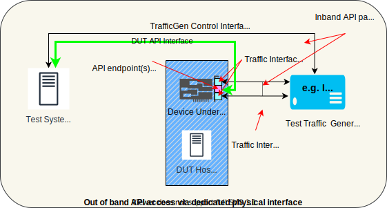
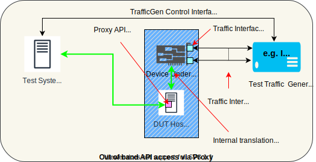

[[ < Test docs Table of Contents ]](./README.md)

[[ << DASH/test main README ]](../README.md)

[[ << DASH main README ]](../../README.md)

# DASH Test Reference ARchitectures
This document provides a set of reference architectures and vocabulary used for testing devices and systems.

# Reference Testbed Architecture - Single DUT

**Figure 1. Testbed Reference Architecture**

The reference architecture, See Figure 1, contains the following elements.

* **DUT** or **SUT** - the device(s) or system(s) being tested.
* **DUT Host/Chassis/Fixture** - If the DUT consists of a NIC Card, it will need a chassis or fixture to provide, at a minimum, system power. For the sake of testing a DUT, the DUT "Host" is not part of the test. Note, the DUT could conceivably be installed in the test System Controller, provided there is no degradation or impact upon the testing results.
* **Test System Controller** or just **Controller** - a compute server running in a physical, virtual or cloud-hosted environment which runs the tests by configuring DUTs, applying stimulus directly or via test packet generators, gathering test result data, analyzing the data and reporting results.
* **Test Traffic Generator/Receiver** or just **TGen** - A tester which sends and receive packets to/from the device under test, commanded by the Test System Controller. It is possible that the TGen can be combined in the Controller, e.g. a server with a suitable network interface can act as the test controller *and* traffic generator, as long as the capabilities of the embedded TGen meet the performance requirements of a particular test. This detail does not affect the roles of each element.
* **Traffic Interfaces** or **Ports** - physical network interfaces which carry traffic between the production network traffic ports and the Traffic generator (acting in lieu of a "real" network or datacenter infrastructure).
* **Traffic Cabling** - Physical cables connecting the DUT with the TGen.
* **DUT Configuration/Management Interfaces** or **APIs** - Socket-based RPCs between the Test System Controller and the Device Under test, used to configure and query the device.
* **DUT API Endpoints** - Server IP address:port(s) on the device (or a [Proxy API Endpoint Server](#proxy-api-endpoint-server)) which listens for RPC messages from the Test System Controller.

## Physical Configurations for DUT API Endpoints
Figure 1 depicts a conceptual DUT API endpoint but does not specify the actual physical means of connecting the Test Controller with the Endpoint. These endpoints may be reachable via different physical means, for example:
* Out-of-band management Ethernet port
* Out-of-band device-driver (PCIe bus))
* In-band (using one or more traffic ports)
* Proxy Server

A DUT might implement one or more of these simultaneously. DUT suppliers must provide a way to establish a connection between the Test Controller and the API endpoint(s) such that the Test Controller has a consistent socket interface. Test fixture setup should be easily automatable without special coding on the test framework and main test scripts. Suppliers must provide easy-to-use fixture setups which can be invoked by automated test pipelines.

### Out-of-Band DUT API Endpoint via Dedicated Physical Interface
This configuration is depicted in Figure 2 and uses a dedicated physical management port for API control of the DUT, e.g. an RJ-45 Ethernet jack on the DUT panel.

**Figure 2. Out of Band Access to DUT API Endpoint via Physical Interface**

### Out-of-Band DUT API Endpoint via PCIe Interface
This configuration is depicted in Figure 3 and uses a "virtual" management port for API control of the DUT, e.g. a network interface device driver operating over the PCIe bus. The test controller communicates to the endpoint via the device's assigned IP address. The host operating system takes care of routing to the endpoint.

**Figure 3. Out of Band Access to DUT API Endpoint via PCIe Device Driver**

### In-Band DUT API Endpoint via Traffic Generator
This scenario uses a DUT traffic port(s) to convey both production traffic and API RPC traffic, and the traffic generator acts as a switch to combine and separate the flows. The test controller sends API traffic into the Traffic Generator management port (or equivalent), and the Traffic Generator combines this with test traffic into the DUT's traffic port. The reverse happens in the opposite direction. Figure 4 illustrates conceptually how this might work. The encapsulation/switching method is not stipulated, but could be e.g. via VLAN tagging.

**Figure 4. Inband Access to DUT API Endpoint Via Traffic Generator**

### In-Band DUT API Endpoint via External Switch
This scenario uses a DUT traffic port(s) to convey both production traffic and API RPC traffic, and an external switch combines and separates the flows. The test controller sends API traffic into the switch, which combines this with test traffic into the DUT's traffic port. The reverse happens in the opposite direction. Figure 5 illustrates conceptually how this might work. The encapsulation/switching method is not stipulated, but could be e.g. via VLAN tagging.

**Figure 5. Inband Access to DUT API Endpoint Via Traffic Generator**

### Proxy API Endpoint Server
Although it is intended that the API endpoints are running natively on the DUT itself, it is conceivable that a software agent/proxy can provide this endpoint, e.g. in an appliance which hosts a SmartNIC adaptor card. Such an agent *could* translate the standardized endpoint API calls into whatever form the DUT requires, e.g. PCIe bus driver calls directly to the device, or into a non-standard proprietary RPC which then gets relayed to the device.  In all cases, the Test Controller should not have to treat the combination of proxy + device any differently than it treats an integrated device with onboard API endpoint. See Figure 6.

**Figure 6. Out-of-band Access to DUT API Endpoint Via Proxy**

# Reference Testbed Architecture - System-Level & Multiple DUTs
**TODO**

# Reference Testbed Architecture - High-Availability
**TODO**
